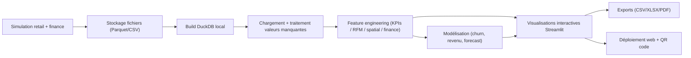

# Portfolio Data App (Python / Streamlit)

Application portfolio Data Scientist / Data Analyst / Data Engineer, construite en Python, qui couvre la chaîne complète:
- simulation de données réalistes (retail + finance),
- qualité et stockage analytique (Parquet/CSV + DuckDB),
- exploration avancée (EDA, corrélations, analyses factorielles, spatial, BI),
- modélisation (classification churn, régression revenu, forecasting),
- reproductibilité (tests, scripts, pipeline, CI),
- exposition web (Streamlit) + génération QR.

## Sommaire
1. [Architecture globale](#architecture-globale)
2. [Structure du dépôt](#structure-du-dépôt)
3. [Prérequis](#prérequis)
4. [Installation](#installation)
5. [Exécution locale](#exécution-locale)
6. [Lancement / arrêt de l’application](#lancement--arrêt-de-lapplication)
7. [Simulation des données](#simulation-des-données)
8. [Détails du code (module par module)](#détails-du-code-module-par-module)
9. [Pages et fonctionnalités Streamlit](#pages-et-fonctionnalités-streamlit)
10. [Tests, qualité, CI/CD](#tests-qualité-cicd)
11. [Déploiement et QR code](#déploiement-et-qr-code)
12. [Troubleshooting](#troubleshooting)

## Architecture globale



## Structure du dépôt

```text
.
├── app/
│   └── main.py                      # Application Streamlit (navigation + pages)
├── src/portfolio_app/
│   ├── __init__.py                  # API package
│   ├── config.py                    # Dataclasses de config
│   ├── simulation.py                # Génération retail + finance
│   ├── storage.py                   # Bundle data + DuckDB
│   ├── preprocessing.py             # Stratégies de gestion des manquants
│   ├── features.py                  # KPIs / features business & finance
│   ├── modeling.py                  # Modèles ML + forecast
│   ├── quality.py                   # Contrôles de qualité
│   ├── erd.py                       # Introspection DB + modèle/layout ERD
│   └── miro.py                      # Service backend Miro (sync + embed)
├── pipelines/
│   └── main_flow.py                 # Pipeline batch + wrapper Prefect
├── scripts/
│   ├── generate_data.py             # CLI génération data
│   ├── generate_qr.py               # CLI génération QR
│   ├── start_app.sh                 # Start Streamlit (foreground/background)
│   └── stop_app.sh                  # Stop Streamlit
├── tests/
│   ├── test_simulation.py
│   ├── test_features.py
│   ├── test_modeling.py
│   └── test_smoke_app.py
├── docs/
│   ├── architecture.md
│   ├── data_dictionary.md
│   └── erd_miro.md                  # Intégration page Schémas ERD + Miro
├── data/processed/                  # Données simulées et DB locale
├── models/                          # Artifacts pipeline
├── .github/workflows/ci.yml         # Lint + tests
├── pyproject.toml                   # Dépendances Poetry
└── Dockerfile
```

## Prérequis

- OS: macOS / Linux / Windows (WSL recommandé)
- Python: `>=3.10,<3.13` (recommandé: Python 3.12)
- Optionnel: Poetry 2.x

Pourquoi cette borne Python: certaines dépendances data (notamment `great-expectations`) ne publient pas encore de roues stables pour Python 3.14.

## Installation

### Option A: Poetry (recommandée)

```bash
poetry install
```

### Option B: venv + pip

```bash
python3.12 -m venv .venv
source .venv/bin/activate
python -m pip install --upgrade pip
python -m pip install -e .
```

## Exécution locale

### 1) Générer les données simulées

```bash
poetry run python scripts/generate_data.py --force
```

Exemple paramétré:

```bash
poetry run python scripts/generate_data.py \
  --seed 42 \
  --n-stores 120 \
  --n-customers 20000 \
  --n-products 3000 \
  --n-orders 120000 \
  --n-assets 20 \
  --missing-rate 0.03 \
  --force
```

### 2) Lancer l’application Streamlit

```bash
poetry run streamlit run app/main.py
```

## Lancement / arrêt de l’application

Scripts utilitaires inclus:

```bash
./scripts/start_app.sh              # mode foreground (Ctrl+C pour arrêter)
./scripts/start_app.sh --background # mode background (PID enregistré)
./scripts/stop_app.sh               # arrêt via PID et nettoyage port
```

Comportement:
- `start_app.sh` ouvre une nouvelle fenêtre Google Chrome vers `http://localhost:8501`.
- en mode `--background`, les logs sont écrits dans `logs/streamlit.log`.
- `stop_app.sh` lit `.streamlit_app.pid` puis force l’arrêt si nécessaire.

## Simulation des données

### Tables retail simulées
- `stores`: géographie et capacité magasin.
- `products`: catégories, prix, coûts, marge cible, périssable.
- `customers`: profil, fidélité, canal d’acquisition, géolocalisation.
- `orders`: entête commande (datetime, canal, promo, statut, montant).
- `order_items`: lignes de ventes (qty, unit_price, discount, line_amount).
- `promotions`: fenêtre promo, scope, uplift attendu.
- `weather_store_day`: météo journalière par magasin.
- `events_city_day`: événements locaux par ville/date.
- `inventory_store_day`: stock mensuel, entrées/sorties, pertes.
- `returns`: retours produits et remboursements.

### Tables finance simulées
- `assets`: univers d’actifs.
- `prices_daily`: OHLCV + `adj_close`.
- `macro`: taux, inflation proxy, croissance proxy, volatilité.
- `portfolios_daily`: poids de portefeuilles simulés.
- `trades`: transactions d’une stratégie momentum simplifiée.

### Scénarios injectés dans la simulation
- saisonnalité annuelle + week-end + pics fin d’année,
- promotions (uplift variable, parfois nul),
- impact météo et extrêmes sur le canal (`delivery` vs `in_store`),
- pannes magasins (fermés 3 jours),
- outliers de transaction,
- retours clients,
- crash de marché simulé et stress macro.

### Valeurs manquantes
- injection contrôlée (`missing_rate` 0.0 à 0.4 côté simulation),
- traitement configurable dans l’app:
  - conserver brut,
  - imputation médiane/mode,
  - imputation zéro/Unknown,
  - suppression lignes incomplètes,
  - forward fill temporel + mode.

## Détails du code (module par module)

### `src/portfolio_app/simulation.py`

Fonctions clés:
- `_inject_missing_values`: injecte des NA hors clés techniques/protégées.
- `_generate_stores|products|customers|promotions|weather|events`: dimensions et faits intermédiaires.
- `simulate_retail_data`: construit `orders`, `order_items`, `returns`, `inventory_store_day`.
  - calcule `order_amount` depuis les lignes,
  - annule les commandes pendant fermetures,
  - force des anomalies/outliers sur un sous-ensemble.
- `simulate_finance_data`: génère `assets`, `prices_daily`, `macro`, `portfolios_daily`, `trades`.
  - inclut un régime de crash,
  - relie rendements aux signaux macro et volatilité.
- `top_basket_pairs`: paires fréquentes de produits.

### `src/portfolio_app/storage.py`

- `_write_table`: persiste prioritairement en Parquet, fallback CSV.
- `_read_table`: charge Parquet/CSV avec parsing des dates.
- `ensure_data_bundle`: génère le bundle complet si absent (ou `force=True`).
- `load_data_bundle`: charge toutes les tables dans un `dict[str, DataFrame]`.
- `build_duckdb`: reconstruit `data/processed/portfolio.duckdb`.

### `src/portfolio_app/preprocessing.py`

- `apply_missing_value_strategy`: applique une stratégie globale de nettoyage.
- gestion différenciée numérique / datetime / bool / catégoriel.

### `src/portfolio_app/features.py`

- `compute_store_daily_kpis`: CA, txns, panier moyen, items/txn, marge, promo uplift.
- `compute_customer_features`: fréquence, monétaire, récence, tenure, churn label, RFM score, CLV proxy.
- `compute_product_features`: unités, CA, marge, affinités produit-produit.
- `compute_spatial_features`: distance client->store, Moran’s I global.
- `compute_finance_metrics`: Sharpe, Sortino, max drawdown, VaR 95%, beta, CAGR.
- `compute_all_features`: point d’entrée unique des features.

### `src/portfolio_app/modeling.py`

- `train_churn_model`:
  - pipeline scikit-learn (imputation + scale + one-hot),
  - RandomForestClassifier,
  - métriques: ROC-AUC, PR-AUC, F1, precision, recall.
- `train_revenue_model`:
  - RandomForestRegressor,
  - variables temporelles dérivées (`weekday`, `month`),
  - métriques: RMSE, MAE, MAPE, R2.
- `forecast_store_revenue`:
  - ETS/Holt-Winters (`statsmodels`) si disponible,
  - fallback robuste rolling mean.

### `src/portfolio_app/quality.py`

- `run_basic_quality_checks`: checks d’intégrité et cohérence:
  - unicité PK,
  - FKs valides,
  - quantités non négatives,
  - cohérence OHLC,
  - dates macro non nulles.
- `run_ge_if_available`: hook Great Expectations optionnel.

### `pipelines/main_flow.py`

- `run_pipeline`:
  1. génère data,
  2. charge bundle,
  3. lance qualité,
  4. calcule features,
  5. entraîne churn + revenue,
  6. exporte artifacts dans `models/`.
- `run_prefect_flow`: encapsulation Prefect si librairie disponible.

### `scripts/`

- `generate_data.py`: CLI de simulation (taille, seed, missing rate, force, output dir).
- `generate_qr.py`: crée un QR PNG à partir d’une URL publique.
- `start_app.sh`: lance Streamlit (foreground/background), ouvre Chrome.
- `stop_app.sh`: arrête process PID + nettoyage port.

### `tests/`

- `test_simulation.py`: présence tables et colonnes attendues.
- `test_features.py`: présence des sorties feature engineering.
- `test_modeling.py`: existence des métriques clés après entraînement.
- `test_smoke_app.py`: compilation syntaxique de `app/main.py`.

## Pages et fonctionnalités Streamlit

Entrée: `app/main.py`

Navigation:
- menu principal vertical gauche (`st.sidebar.radio`),
- sous-menu horizontal (`st.radio(horizontal=True)`),
- système `pending_navigation` pour redirection depuis le Sommaire.

Sections principales:
1. `Accueil & Profil`
   - `Introduction`, `Sommaire`, `Architecture du projet`, `Profil & CV`.
2. `Données`
   - `Dictionnaire de données`, `Schémas ERD`, `Données brutes`, `Paramètres de génération`, `Qualité des données`.
3. `Dashboard et BI`
   - `Dashboard KPI exécutif`, `Analyse du panier d'achat`, `Dashboard Cloud`.
4. `Analyse exploratoire (EDA)`
   - `Représentations graphiques`, `Corrélations`, `Analyse factorielle`.
5. `Spatio-temporel`
   - `Carte`, `Analyse Spatiale`, `Animation`.
6. `Modélisation`
   - `Forecasting`, `Churn/Propensity`, `CLV & Segmentation`.
7. `Ops & Reproductibilité`
   - `MLflow`, `Pipeline Prefect`, `Export & CI/CD`.

Fonctionnalités avancées EDA:
- jointure multi-tables automatique (avec agrégation anti-explosion),
- catalogues d’exemples guidés,
- matrice de corrélation Pearson + p-value + seuil de significativité,
- carte de corrélation masquée sur relations non significatives,
- analyse factorielle multi-méthodes:
  - ACP, AFC, ACM, CAH, AFM.

## Tests, qualité, CI/CD

### Local

```bash
poetry run ruff check .
poetry run black --check .
poetry run pytest
```

### GitHub Actions

Workflow: `.github/workflows/ci.yml`
- Python 3.11
- `poetry install`
- `ruff check`
- `black --check`
- `pytest`

## Déploiement et QR code

### Docker

```bash
docker build -t portfolio-data-app .
docker run -p 8501:8501 portfolio-data-app
```

### Génération QR

```bash
poetry run python scripts/generate_qr.py \
  --url "https://votre-url-publique.streamlit.app" \
  --output "docs/assets/portfolio_qr.png"
```

Le QR doit pointer vers l’URL publique déployée de l’application.

## Troubleshooting

### `poetry: command not found`

```bash
python -m pip install poetry
python -m poetry --version
```

### Erreur de version Python (`>=3.10,<3.13`)

Vérifier:
```bash
python --version
```

Utiliser Python 3.12 pour l’environnement du projet.

### L’app ne s’arrête pas

- si lancée en foreground: `Ctrl + C` dans le terminal actif;
- si lancée en background: `./scripts/stop_app.sh`.

### Warning Streamlit `use_container_width`

Certains composants Streamlit évolueront vers `width="stretch"`/`"content"`.  
Ce warning n’empêche pas l’exécution.

## Notes sécurité / repo

- Le `.gitignore` inclut les artefacts sensibles et fichiers temporaires.
- Ne pas versionner de secrets (`.env`, clés API, credentials cloud, etc.).
- Les CV/images perso sont présents localement, à publier selon votre stratégie de visibilité.
