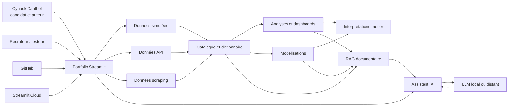

# Carte des entités et connexions du portfolio

## Entités principales

Le portfolio repose sur plusieurs grands objets reliés entre eux.

| Entité | Définition | Rôle dans l'application |
|---|---|---|
| Cyriack Dauthel | Personne physique, candidat et auteur du portfolio | Porte le projet et postule auprès d'une audience professionnelle |
| Recruteur ou testeur | Utilisateur externe de l'application | Évalue la clarté, la rigueur et la valeur du portfolio |
| Application Streamlit | Interface interactive du portfolio | Rend visibles les données, analyses, modèles et architectures |
| Données simulées | Jeux de données internes générés par l'application | Servent de socle contrôlé pour les démonstrations analytiques |
| Données API | Tables collectées via connecteurs API | Enrichissent l'application avec des sources externes structurées |
| Données scraping | Tables extraites depuis des pages HTML publiques | Complètent les APIs quand la donnée n'est pas disponible autrement |
| Catalogue de données | Référentiel des tables disponibles | Documente les jeux de données, leur origine et leur structure |
| Modèles | Méthodes statistiques, ML, DL, spatiales, temporelles ou physiques | Produisent des diagnostics, prédictions, simulations ou interprétations |
| Assistant IA | Chatbot documentaire relié au RAG | Explique l'application et aide à naviguer dans le projet |
| RAG | Mécanisme de recherche documentaire | Récupère les passages pertinents avant appel au LLM |
| LLM | Modèle de langage local ou distant | Génère une réponse à partir du contexte RAG |
| Streamlit Cloud | Hébergement public de l'application | Permet de partager l'app via URL ou QR code |
| GitHub | Dépôt du code et de la documentation | Versionne le projet sans secrets ni modèles lourds |

## Graphe conceptuel

## Connexions importantes

### Candidat -> portfolio

Le portfolio représente le travail de Cyriack Dauthel. Il ne doit pas être confondu avec le chatbot. Le candidat est la personne évaluée; l'assistant est seulement une interface d'aide à la lecture.

### Portfolio -> données

L'application combine données simulées, données collectées via API et données scrappées. Les données simulées servent à démontrer des cas métier contrôlés. Les données API/scraping montrent la capacité de collecte et d'enrichissement externe.

### Données -> analyses

Les analyses exploratoires, client, spatiales et temporelles utilisent les tables disponibles pour produire des distributions, cartes, séries, segmentations, diagnostics et comparaisons.

### Données -> modèles

Les modèles utilisent les variables disponibles comme cibles, variables explicatives, coordonnées, dates ou segments. Les résultats doivent être lus avec leurs métriques, diagnostics et hypothèses.

### Documentation -> RAG

Le RAG indexe la documentation, les profils de tables et les explications. Il aide l'assistant à répondre sans inventer.

### RAG -> LLM -> utilisateur

Le RAG fournit le contexte. Le LLM formule la réponse. L'utilisateur doit pouvoir comprendre d'où vient l'information et quelles sont ses limites.

## Règle anti-confusion

Si l'utilisateur demande "le modèle", l'assistant doit clarifier le sens:

- modèle de langage LLM;
- modèle Machine Learning;
- modèle statistique;
- modèle spatial;
- modèle temporel;
- modèle physique;
- modèle conceptuel de l'application.

La réponse doit préciser le type de modèle concerné avant d'expliquer.
